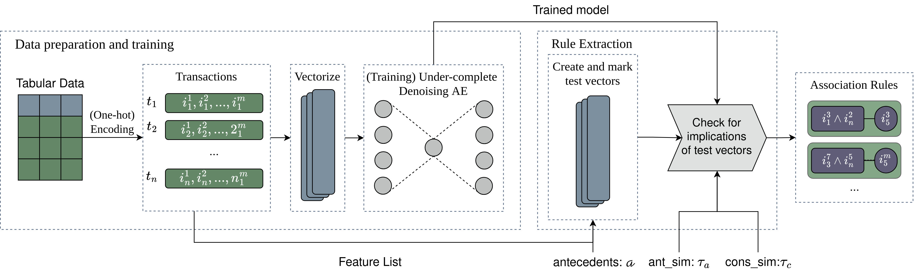
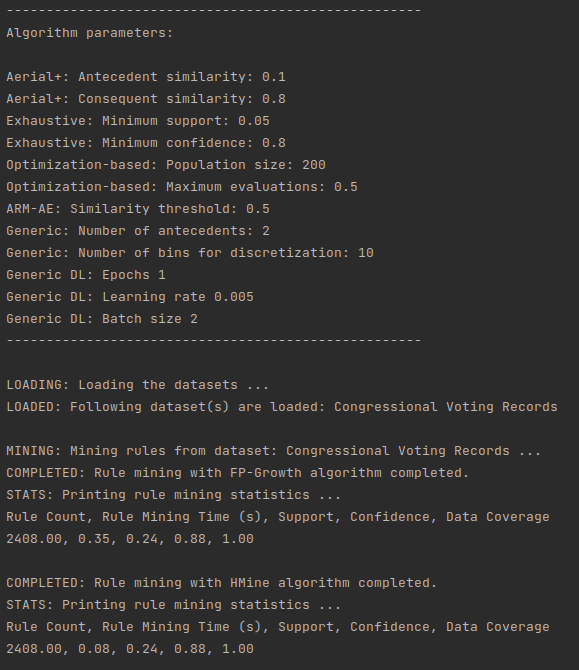
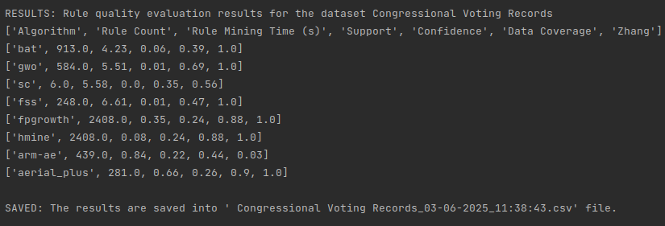
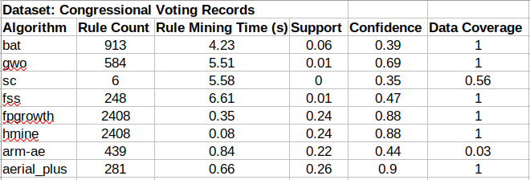
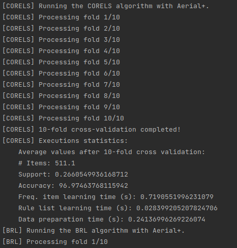

# Aerial+: Neurosymbolic Association Rule Mining from Tabular Data

This repository contains the source code of the experiments for Aerial+ neurosymbolic Association Rule Mining (ARM)
method and the baselines, as described in the paper entitled "_Neurosymbolic Association Rule Mining from Tabular
Data_".

This document is a brief guideline describing Aerial+, datasets and the baselines used in the experiments
and how to run the experiments

---

⭐ **New Python library available!**

Please also see the Python library of Aerial+ (PyAerial): [https://github.com/DiTEC-project/pyaerial](https://github.com/DiTEC-project/pyaerial).

---

### Table of Contents

1. [About](#about)
2. [Datasets](#datasets)
3. [Baselines](#baselines)
4. [Code structure](#code-structure)
5. [How to run?](#how-to-run)
6. [How to reuse?](#how-to-reuse)
7. [References](#references)

## About

Aerial+ is a neurosymbolic ARM method that addresses the rule explosion and long execution times problem in ARM research
for tabular data. It utilizes Deep Learning (DL) to address the high-dimensionality of data and it consists of two
steps: i) a neural representation of the tabular data is created using an under-complete denoising autoencoder [1],
which captures the associations between data features (Section 3.2 of the paper); ii) the associations rules are then
extracted by exploiting the reconstruction mechanism of the autoencoder (Section 3.3). The details of
each step can be found in our paper. The pipeline of operations are shown in below figure:

## Datasets

The datasets used in the evaluation is taken from UCI ML Repository [2], a standard benchmark in the
ARM literature [3].

- [Breast Cancer](https://archive.ics.uci.edu/dataset/14/breast+cancer)
- [Congressional Voting Records](https://archive.ics.uci.edu/dataset/105/congressional+voting+records)
- [Mushroom](https://archive.ics.uci.edu/dataset/73/mushroom)
- [Chess (King-Rook vs. King-Pawn)](https://archive.ics.uci.edu/dataset/22/chess+king+rook+vs+king+pawn)
- [Spambase](https://archive.ics.uci.edu/dataset/94/spambase)

## Baselines

Aerial+ is evaluated based on both rule quality and downstream classification tasks as part of well-known
interpretable Machine Learning (ML) models.

The baselines used in rule quality:

- Exhaustive methods: FP-Growth and HMine are two well-know exhaustive methods. We implemented both
  algortihms using Mlxtend Python package [4]. The implementations can be found in
  [_src/algorithm/classic_arm_](src/algorithm/classic_arm.py) file.
- Optimization-based methods: The optimization-based ARM algorithms are implemented using the NiaARM [5]
  and the NiaPY [6] Python packages. The implementation can be found in
  [_src/algorithm/optimization_arm_](src/algorithm/optimization_arm.py) file.
- The DL-based ARM-AE algorithm is taken from its original paper and source code [7]. The implementation
  can be found under [src/algorithm/arm_ae](src/algorithm/arm_ae) folder.

CBA [8], BRL [9] and CORELS [10] are three popular rule-based interpretable ML models that are used in
the downstream classification experiments:

- CBA: implemented using [pyARC](https://github.com/jirifilip/pyARC) [11].
- BRL: implemented using [imodels](https://github.com/csinva/imodels) [12].
- CORELS: implemented using [imodels](https://github.com/csinva/imodels) [12].

## Code Structure

- **Rule quality experiments**: given under the main folder in [
  _rule_mining_experiments.py_](rule_mining_experiments.py)
  Python file.
- **Downstream classification experiments as part of interpretable ML models**: given under the main folder in
  [_classification_experiments.py_](classification_experiments.py) Python file.
- **Algorithms**:
    - Aerial+: given under [_src/algorithm/aerial_plus_](src/algorithm/aerial_plus) folder. [
      _autoencoder.py_](src/algorithm/aerial_plus/autoencoder.py)
      contains Aerial+'s Autoencoder architecture, while [
      _src/algorithm/aerial_plus/aerial_plus.py_](src/algorithm/aerial_plus/aerial_plus.py)
      contains rule extraction algorithm of Aerial+.
    - Exhaustive methods: FP-Growth and HMine are implemented under
      [_src/algorithm/classic_arm.py_](src/algorithm/classic_arm.py) file.
    - Optimization-based ARM: all of the optimization-based ARM methods are implemented in [
      _src/algorithm/optimization_arm.py_](src/algorithm/optimization_arm.py) file.
    - ARM-AE: taken from the original implementation of [ARM-AE](https://github.com/TheophileBERTELOOT/ARM-AE)[7], and
      can
      be found under [_src/algorithm/arm_ae_](src/algorithm/arm_ae) folder.
    - CBA: forked from [pyARC](https://github.com/jirifilip/pyARC) and updated version (to use Aerial+ besides
      FP-Growth)
      can be found under [_src/algorithm/cba_](src/algorithm/cba) folder.
    - BRL and CORELS: forked from [imodels](https://github.com/csinva/imodels) source code and the updated (to use
      Aerial+ besides FP-Growth)
      can be found under [_src/algorithm/brl_](src/algorithm/brl) and [_src/algorithm/corels_](src/algorithm/corels)
      respectively.
- **Parameters**: the parameter settings of the algorithms which are given in Table 2 of our paper can be found and
  updated
  in [config.py](config.py) file.

## How to Run?

1. Configure algorithm parameters in [config.py](config.py) if needed.

2. **Install requirements**: The Python requirements file is placed under the main folder, [_requirements.txt_](requirements.txt).
   Run the following to install all of the requirements: `pip3 install -r requirements.txt`.

3. **Running the rule quality experiments**: in the main folder of this repository, run `python3 rule_mining_experiments.py`.
This script runs all eight algorithms including Aerial+ on _Congressional Voting Records_ dataset. Line 24 of the 
[rule_mining_experiments.py](rule_mining_experiments.py) can be updated to include any other dataset from the UCI ML repository,
e.g., `mushroom = fetch_ucirepo(id=73)` to include mushroom dataset.

Sample output:

Rule mining statistics are printed at the end of the execution:

The results are saved into a `.csv` file with the name of the UCI dataset:

4. **Running the downstream classification experiments**: in the main folder of this repository, run `python3 classification_experiments.py`.
If you receive a `Permission denied: './corels'` error message, make sure that `src/algorithm/corels/src/corels` is executable
by running `chmod +x src/algorithm/corels/src/corels`. This script runs all three classification algorithms with Aerial+ and FP-Growth as done in the paper, on _Congressional Voting Records_ dataset. 
Line 26 of the [classification_experiments.py](classification_experiments.py) can be updated to include any other dataset from the UCI ML repository,
e.g., `mushroom = fetch_ucirepo(id=73)` and `datasets += [(mushroom, "poisonous", {'e': 0, 'p': 1})]` to include mushroom dataset
with class labels and categories for classification.

Sample output:

## How to Reuse?

The source code of Aerial+ can be found under [`src/algorithm/aerial_plus`](src/algorithm/aerial_plus) folder, with the 
Autoencoder  implementation given in [`src/algorithm/aerial_plus/autoencoder`](src/algorithm/aerial_plus/autoencoder.py) 
and the rule extraction algorithm given in [`src/algorithm/aerial_plus/aerial_plus.py`](src/algorithm/aerial_plus/aerial_plus.py) file.

The layer size and dimension of the autoencoder can be (and should be) changed depending on the dataset used. And the algorithm
configurations are defined in the `__init__.py` of [`src/algorithm/aerial_plus/aerial_plus.py`](src/algorithm/aerial_plus/aerial_plus.py),
which can also be changed with a configuration file as we have done with [`config.py`](config.py).

The `AerialPlus` class can easily be integrated with another code base together with its `Autoencoder` implementation (or others),
by copying the entire class `AerialPlus` and `Autoencoder` class and can be run with any dataset in the form of transactions.

## References

[1] Pascal Vincent, Hugo Larochelle, Yoshua Bengio, and Pierre-Antoine Manzagol. 2008. Extracting and composing robust
features with denoising autoencoders. In Proceedings of the 25th international conference on Machine learning.
1096–1103.

[2] Markelle Kelly, Rachel Longjohn, and Kolby Nottingham. 2023. The UCI machine learning repository.
URL https://archive. ics. uci. edu (2023).

[3] Minakshi Kaushik, Rahul Sharma, Iztok Fister Jr, and Dirk Draheim. 2023. Numerical association rule mining: a
systematic literature review. arXiv preprint arXiv:2307.00662 (2023).

[4] Sebastian Raschka. 2018. MLxtend: Providing machine learning and data science utilities and extensions to Python’s
scientific computing stack. The Journal of Open Source Software 3, 24 (April 2018). https://doi.org/10.21105/joss.00638

[5] Žiga Stupan and Iztok Fister. 2022. Niaarm: a minimalistic framework for numerical association rule mining. Journal
of Open Source Software 7, 77 (2022), 4448.

[6] Grega Vrbančič, Lucija Brezočnik, Uroš Mlakar, Dušan Fister, and Iztok Fister. 2018. NiaPy: Python microframework
for building nature-inspired algorithms. Journal of Open Source Software 3, 23 (2018), 613.

[7] Berteloot, Théophile, Richard Khoury, and Audrey Durand. "Association Rules Mining with Auto-Encoders." arXiv
preprint arXiv:2304.13717 (2023).

[8] Bing Liu, Wynne Hsu, and Yiming Ma. Integrating classification and association rule
mining. In Proceedings of the Fourth International Conference on Knowledge Discovery
and Data Mining, KDD, pages 80–86, 1998.

[9] Benjamin Letham, Cynthia Rudin, Tyler H McCormick, and David Madigan. Interpretable
classifiers using rules and bayesian analysis: Building a better stroke prediction model.

[10] Elaine Angelino, Nicholas Larus-Stone, Daniel Alabi, Margo Seltzer, and Cynthia Rudin.
Learning certifiably optimal rule lists for categorical data. Journal of Machine Learning
Research, 18(234):1–78, 2018.

[11] Jiˇr´ı Filip and Tom´aˇs Kliegr. Classification based on associations (cba)-a performance anal-
ysis. Technical report, EasyChair, 2018.

[12] Chandan Singh, Keyan Nasseri, Yan Shuo Tan, Tiffany Tang, and Bin Yu. imodels: a python
package for fitting interpretable models, 2021. URL https://doi.org/10.21105/joss.03192.
